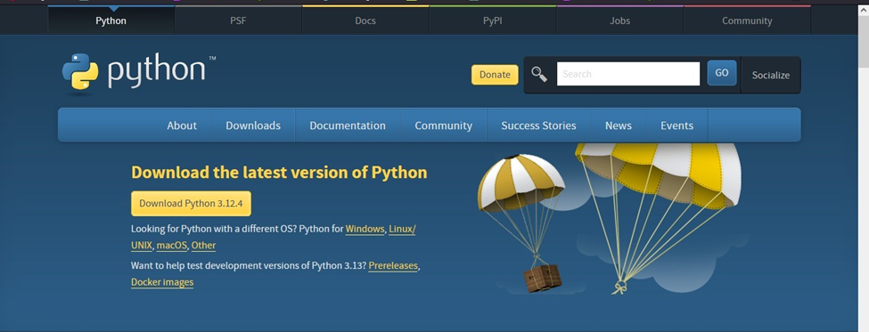
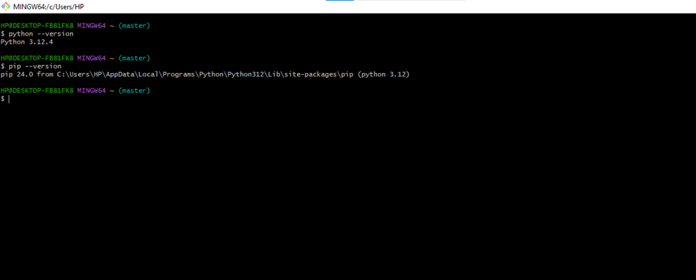

[](https://classroom.github.com/a/WfNmjXUk)
[](https://classroom.github.com/online_ide?assignment_repo_id=15338517&assignment_repo_type=AssignmentRepo)
# SE-Assignment-6
 Assignment: Introduction to Python
Instructions:
Answer the following questions based on your understanding of Python programming. Provide detailed explanations and examples where appropriate.

 Questions:

1. Python Basics:
   - What is Python, and what are some of its key features that make it popular among developers? Provide examples of use cases where Python is particularly effective.
Python is a high-level programming language known for its simplicity and readability. It was created by Guido van Rossum 
Key features include:
   1. Easy to learn and use - its syntax mimics natural language.
   2. Versatile and powerful - supports various programming paradigms.
   3. Extensive libraries - large standard libraries that support common programming tasks.
   4. Community support - has a large and active community of developers who contribute to its development and create libraries

2. Installing Python:
   - Describe the steps to install Python on your operating system (Windows, macOS, or Linux). Include how to verify the installation and set up a virtual environment.
Steps for Installing Python:

1. Download Python:
   - Visit the official Python website: [Python Download](https://www.python.org/downloads/).
   - Download the latest version of Python for Windows.

2. Installation Process:
   - Run the installer, ensure you check the option to add Python to PATH.
   - Follow the installation wizard.
3. Verify Installation:
   - Open Command Prompt and type:
 	```bash
 	python --version
 	```
   - Verify pip installation:
 	```bash
 	pip --version
 	```

4. Setting Virtual environment:
   1. Install virtualenv (if not already installed):
   Use pip to install virtualenv globally:
   ``bash
   pip install virtualenv
   2. Create a Virtual Environment:
   Choose or create a directory for your project.
   Navigate to the directory using Terminal or Command Prompt
   Create a virtual environment named venv (you can choose any name)
   ```bash
   virtualenv venv
```
   3. Activate the Virtual Environment:
   ```bash
   venv\Scripts\activate
```
3. Python Syntax and Semantics:
   - Write a simple Python program that prints "Hello, World!" to the console. Explain the basic syntax elements used in the program.
   # Simple Python program to print "Hello, World!"
print("Hello, World!")
##Syntax elements used
1. Comment - Python comments start with the # character and extend to the end of the line.
2. Print statement - The `print()` function in Python is used to output text

4. Data Types and Variables:
   - List and describe the basic data types in Python. Write a short script that demonstrates how to create and use variables of different data types.
##Data types
   1. Integer (`int`) - Represents positive or negative whole numbers without any decimal point.
   2. Float (`float`) - Represents real numbers (numbers with a decimal point).
   3. String (`str`) - Represents a sequence of characters enclosed within single quotes (') 
   4. Boolean (`bool`) - Represents a truth value, which can be either True or False.
##How to craete variables 
# Define variables of different data types
age = 25             # integer variable
height = 5.9         # float variable
name = "John Doe"    # string variable
is_student = True    # boolean variable
salary = None        # NoneType variable

# Print out the variables
print("Name:", name)
print("Age:", age)
print("Height:", height)
print("Is student?", is_student)
print("Salary:", salary)

# Perform operations using these variables
birth_year = 2024 - age
print(name, "was born in", birth_year)

5. Control Structures:
   - Explain the use of conditional statements and loops in Python. Provide examples of an `if-else` statement and a `for` loop.
Conditional statements and loops are fundamental constructs in Python that allow you to control the flow of execution based on conditions and iterate over sequences of data.
Conditional Statements (`if-else`): Used to execute different blocks of code based on conditions
if condition:
    # code to execute if condition is True
elif another_condition:
    # code to execute if another_condition is True
else:
    # code to execute if all conditions are False
Loops (`for loop`): Used to iterate over a sequence of data (like lists, tuples, strings, etc.) and execute a block of code repeatedly.
for item in sequence:
    # code to execute for each item in the sequence


6. Functions in Python:
   - What are functions in Python, and why are they useful? Write a Python function that takes two arguments and returns their sum. Include an example of how to call this function.
Functions in Python are blocks of reusable code that perform a specific task.They help organize code to logical blocks hence making it easy to read and debug.
##Benefits of functions
   1. Code Reusability: Functions allow you to reuse code without rewriting it multiple times.
   2. Modularity: Functions help break down large programs into smaller, manageable parts.
   3. Readability: Functions improve the readability of your code by giving descriptive names to blocks of code.
   4. Debugging: Functions make debugging easier as you can isolate and test specific parts of your code independently.

   example:
   # Define a function to calculate the sum of two numbers
def calculate_sum(a, b):
    result = a + b
    return result
# Call the calculate_sum function with arguments 3 and 5
sum_result = calculate_sum(3, 5)

# Print the result returned by the function
print("Sum:", sum_result)

7. Lists and Dictionaries:
   - Describe the differences between lists and dictionaries in Python. Write a script that creates a list of numbers and a dictionary with some key-value pairs, then demonstrates basic operations on both.
Lists - this is a ordered collection of items.
Syntax:
Lists are created using square brackets `[]`.
Example:
numbers = [1, 2, 3, 4, 5]
Dictionaries - unordered collections of key-value pairs.
Syntax:
Dictionaries are created using curly braces `{}`.
Examples:
person = {
    "name": "Alice",
    "age": 30,
    "city": "New York"
}


8. Exception Handling:
   - What is exception handling in Python? Provide an example of how to use `try`, `except`, and `finally` blocks to handle errors in a Python script.
   Exception handling in Python allows you to gracefully manage and respond to errors that occur during the execution of your program. It involves using `try`, `except`, and optionally `finally` blocks to handle different types of exceptions that may arise

Example:

# Example: Division by zero error handling

def divide_numbers(a, b):
    try:
        result = a / b
    except ZeroDivisionError:
        print("Error: Division by zero is not allowed.")
    else:
        print("Division result:", result)
    finally:
        print("Execution completed.")

# Example usage
print("Case 1:")
divide_numbers(10, 2)

print("\nCase 2:")
divide_numbers(10, 0)

9. Modules and Packages:
   - Explain the concepts of modules and packages in Python. How can you import and use a module in your script? Provide an example using the `math` module.
Module - A module is a file containing Python definitions (functions, classes, variables) and statements. It allows you to logically organize your Python code into reusable units.
Package - A package is a collection of modules in directories that have an additional `__init__`.py file.

Example:
# Example using the math module
import math

# Calculate square root using math.sqrt() function
num = 25
sqrt_value = math.sqrt(num)
print(f"Square root of {num} is: {sqrt_value}")

# Calculate factorial using math.factorial() function
fact_value = math.factorial(5)
print(f"Factorial of 5 is: {fact_value}")

10. File I/O:
    - How do you read from and write to files in Python? Write a script that reads the content of a file and prints it to the console, and another script that writes a list of strings to a file.
To read from a file in Python, you typically follow these steps:

   1. Open the File: Use the open() function to open a file in read mode (`'r'`). It returns a file object.

   2. Read from the File: Use methods like read(), readline(), or readlines() to read the contents of the file.

   3. Close the File: Close the file using the close() method to free up system resources.

   Example:

   # Reading from a file and printing its content

# Open the file in read mode ('r')
file_name = "sample.txt"
try:
    file = open(file_name, 'r')

    # Read and print the entire content of the file
    file_content = file.read()
    print("Content of", file_name, ":\n", file_content)

except FileNotFoundError:
    print(f"Error: File '{file_name}' not found.")

finally:
    # Close the file
    file.close()


To write to a file in Python, follow these steps:

   1. Open the File: Use the open() function with 'w' mode (write mode) or 'a' mode (append mode) to open the file for writing.

   2. Write to the File: Use the write() method to write data to the file.
   3. Close the File: Always close the file using the close() method to ensure all data is written and resources are freed.

Example:

# Writing a list of strings to a file

# List of strings to write to file
lines = [
    "This is line 1.",
    "This is line 2.",
    "This is line 3."
]

# Open the file in write mode ('w')
file_name = "output.txt"
try:
    with open(file_name, 'w') as file:
        # Write each line from the list to the file
        for line in lines:
            file.write(line + "\n")

    print(f"Successfully wrote {len(lines)} lines to {file_name}")

except IOError:
    print(f"Error: Unable to write to file {file_name}")

# Submission Guidelines:
- Your answers should be well-structured, concise, and to the point.
- Provide code snippets or complete scripts where applicable.
- Cite any references or sources you use in your answers.
- Submit your completed assignment by [due date].


